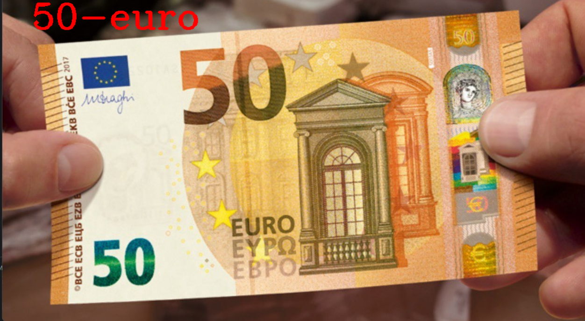

Money Detector Using OpenCV

This is a program to detect money using OpenCV ORB.

## Installation

Run code on your machine:

```bash
  git clone https://github.com/Dipin-Adhikari/Money-Detector.git
  cd Money-Detector
  python3 MoneyProject.py
```
If you haven't installed OpenCV and Numpy on your machine then:

```bash
  pip install opencv-python
  pip install numpy
```


## Screenshots





  
## Authors

- [@Dipin Adhikari](https://github.com/Dipin-Adhikari)

  